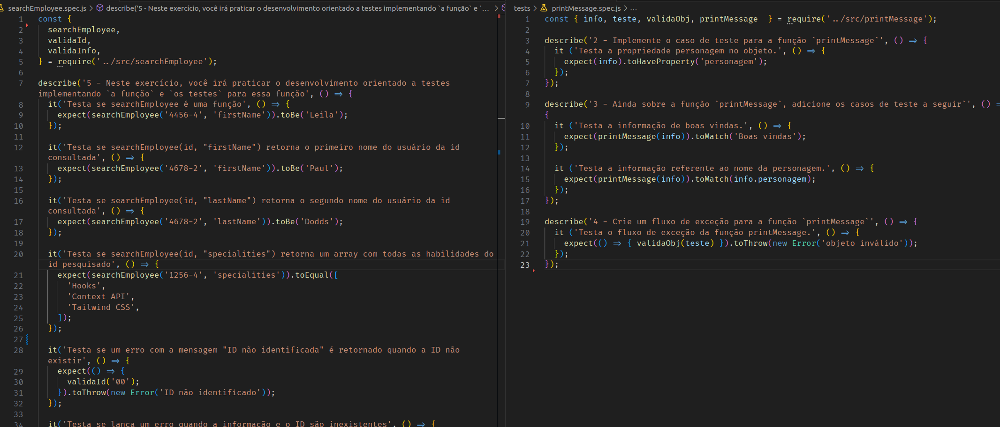

# README: Tests in practice



## Project Description

The purpose of this project is to test all functions in the 'src' folder. This is my first time using Jest to accomplish this task. Additionally, I have written the code for 'searchEmployee.js' and have tested it.

### Technologies

- LINUX
- VSCODE
- JAVASCRIPT
- JEST

### What I Learned

- How to use jest to test functions
- How to write tests before writing a function

## How to Run the Project

1. Clone the repository:

   ```bash
   git clone https://github.com/feduarte-dev/tests-in-practice
   ```

2. Navigate to the project directory:

   ```bash
   cd your-repository
   ```

3. Install dependencies:

   ```bash
   npm install
   ```

4. Test the application:

   ```bash
   npm run test
   ```

## Contributions

[Felipe](https://www.linkedin.com/in/feduarte-dev/)  - /tests - searchEmployee.js


[Trybe](https://www.betrybe.com/) - Everything else
